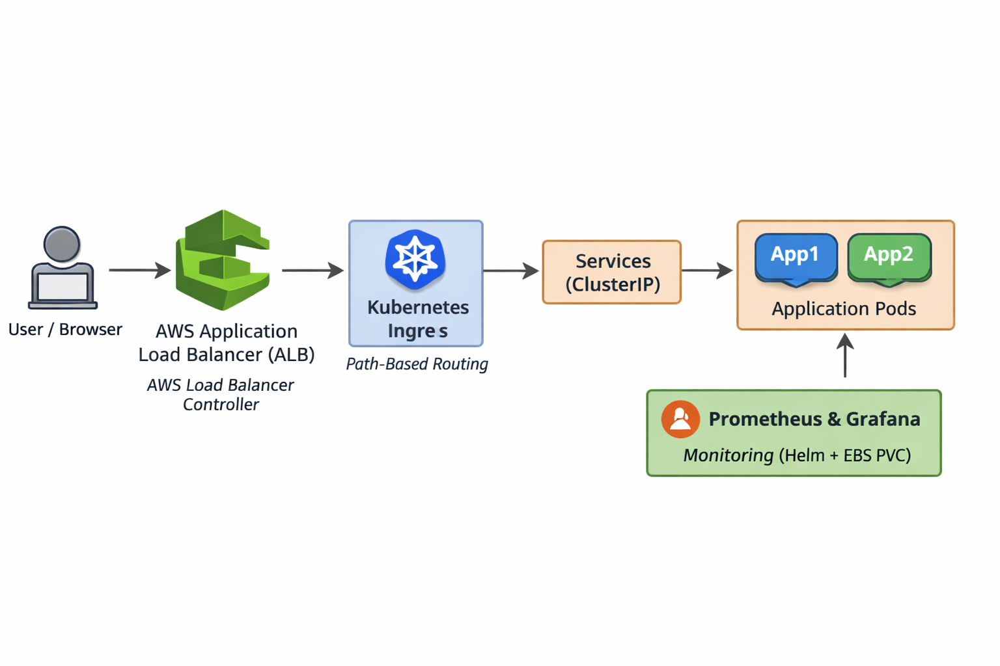
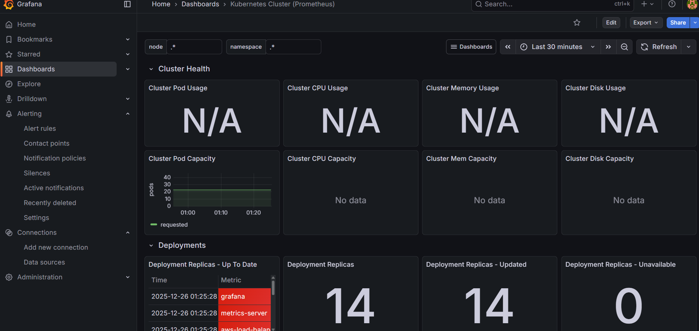
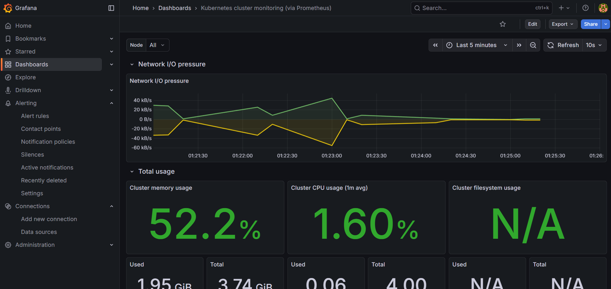
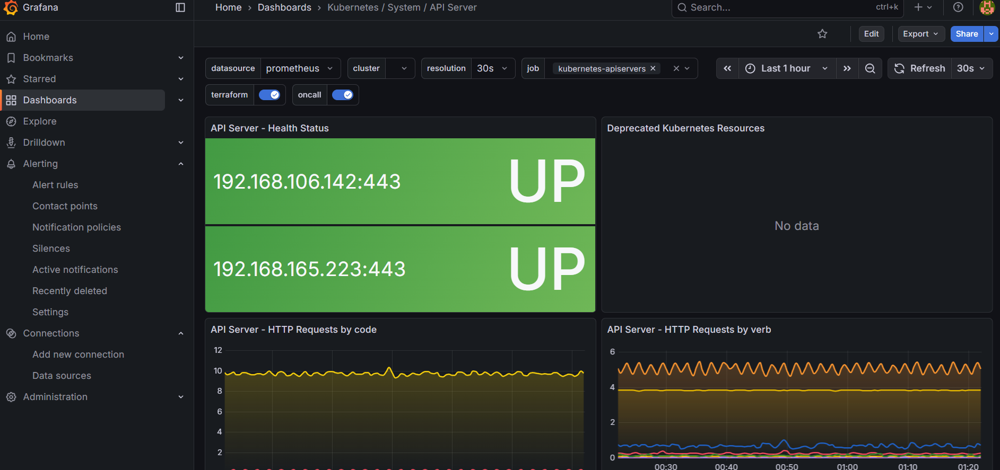
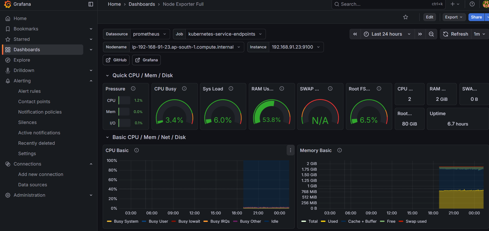

# Kubernetes Ingress with AWS ALB on EKS

This project demonstrates deploying applications on **Amazon EKS**
using **Kubernetes Ingress backed by AWS Application Load Balancer (ALB)**,
with monitoring implemented using **Prometheus and Grafana**.

> This project is built for learning and real-world DevOps practice.

---

## 🏗 Architecture Overview

- Amazon EKS Cluster (ap-south-1 / Mumbai)
- Managed Node Groups
- AWS Load Balancer Controller
- Application Load Balancer (ALB)
- Kubernetes Ingress (path-based routing)
- Prometheus & Grafana for monitoring

**Traffic Flow:**

User → ALB → Ingress → Kubernetes Service → Pod

---
### Architecture Diagram

## 🚀 Features Implemented

- EKS cluster creation using `eksctl`
- AWS Load Balancer Controller with IAM OIDC integration
- ALB-backed Kubernetes Ingress with path-based routing
- Multiple applications deployed (app1, app2)
- Prometheus monitoring stack
- Grafana dashboards for visualization
- Persistent storage using AWS EBS CSI Driver

---

## 🛠 Tools & Technologies

- AWS EKS
- Kubernetes
- eksctl
- kubectl
- Helm
- AWS Application Load Balancer (ALB)
- Prometheus
- Grafana

---

## ⚙️ Key Kubernetes Components

- **Ingress** – Routes external traffic via AWS ALB
- **Service (ClusterIP)** – Internal service exposure
- **Deployment** – Application replicas and scaling
- **PVC & StorageClass** – Persistent storage for monitoring workloads
- **Managed Node Groups** – Compute layer for Kubernetes workloads

---

## 📊 Monitoring Setup

- Prometheus deployed using Helm
- Grafana deployed using Helm
- EBS-backed Persistent Volumes for Prometheus and Alertmanager
- Node Exporter for node-level metrics

**Access (local):**
- Prometheus → `kubectl port-forward svc/prometheus-server 9090`
- Grafana → `kubectl port-forward svc/grafana 3000`

---

## 📸 Monitoring Screenshots

### Grafana Overview Dashboard

### Kubernetes Cluster Metrics

### API Server Metrics

### Node Exporter Metrics

---

## 🧪 Status

✅ EKS Cluster running  
✅ AWS ALB Ingress working  
✅ Applications reachable via ALB  
✅ Prometheus & Grafana running  

---

## 📌 Learning Outcomes

- Hands-on EKS cluster provisioning
- AWS Load Balancer Controller and IAM OIDC setup
- Real-world Kubernetes Ingress with ALB
- Persistent storage troubleshooting using EBS CSI
- Monitoring Kubernetes workloads with Prometheus & Grafana
- End-to-end DevOps project implementation

---

## 👤 Author

**Shameen**  
DevOps / AWS / Kubernetes Learner

